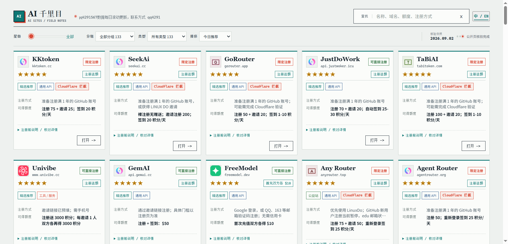

# AI 千里目 · AI FreeNav

[](https://aifreenav.pages.dev/)
[](https://github.com/daugf2527/aifreenav)

一个持续维护的 AI 站点目录，集中整理 AI API 中转、公益站、模型工具和限时福利入口。

**在线体验：[aifreenav.pages.dev](https://aifreenav.pages.dev/)**



## 这里有什么

- 130+ 个 AI API、工具与服务站点
- 中英文界面、站内搜索、分组和星级筛选
- 注册条件、可得额度、模型能力和风险提示分开整理
- 公开页核验记录与更新时间，区分「可达」和「可用」
- 支持批量打开前 20 个推荐站点
- 仅展示公开入口；不收录 API key、Cookie、卡密或临时 token

## 评价口径

星级是编辑排序信号，不是服务质量保证，也不代表长期稳定性。评分会综合公开可验证信息、注册门槛、权益时效、模型/接口线索和近期反馈：

- 4 星：当前信息完整、门槛和权益相对清晰，适合作为优先候选
- 3 星：有明确价值，但存在条件、证据或稳定性限制
- 2 星：可以观察或尝试，关键信息仍需到源站确认
- 1 星：仅保留少量弱证据条目；关闭、不可达或明确风险的条目不作为推荐

Cloudflare 挑战、单次 502、邀请码耗尽或活动过期不会被直接等同为服务关闭；活动只写宣传不等于当前仍有效。

## 本地查看

这是一个无需打包工具的静态站点。克隆后在仓库根目录运行：

```bash
python3 -m http.server 8080
```

然后打开 <http://localhost:8080/>。也可以直接用任意静态文件服务器托管根目录。

## 维护入口

- `supplemental-sites.js`：新增站点、公开入口、来源和站点说明
- `manual-card-facts.js`：卡片展示文本、注册/权益标签和能力标签
- `manual-ratings.js`：最终星级与推荐排序
- `site-review.js`、`site-browser-review.js`：公开核验说明
- `site-data.js`、`site-en.js`：当前中英文目录数据

站点规则、额度、模型库存和活动可能随源站变化。使用前请回到源站确认，并自行评估隐私、稳定性和合规风险。

## 免责声明

本项目只做公开信息整理与入口导航，不代表任何被收录站点，也不保证其可用性、额度、模型库存、接口兼容性或活动持续时间。项目维护者不要求用户提交账号、密码、Cookie 或 API key。

部分入口可能包含推广参数；如有推广关系，会在站内标注。请勿为领取未经核实的福利进行大额充值。

## License

代码和整理内容以 [MIT License](LICENSE) 发布。站点名称、Logo 和第三方内容归其各自权利人所有。
